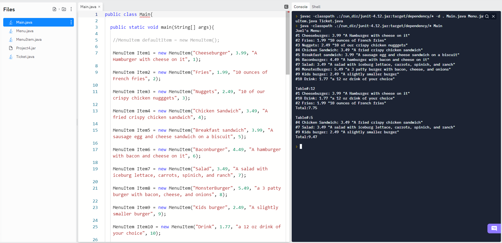

# Java 4- Menu Prototype
 
## Simulated menu with no user input, earlier version of *Java 5 Menu*

#### Description
This program tests the *Menu*, *MenuItem*, and *Ticket* classes through code. The program constructs 10 *MenuItems*, which you can see the structure of below. A *Menu* is then constructed which contains an ArrayList, which will hold the *MenuItems*. The 10 *MenuItems* are then added to the *Menu*. The *Menu* is printed to the console. Two *Tickets* are then constructed, and various *MenuItems* are added to each. Each *Ticket* has an ArrayList* of *MenuItems* along with a *tableNumber*. Each *Ticket* is then printed to the screen along with the total cost of each *Ticket*.

#### MenuItem class structure
```
public class MenuItem{

	private String name;
	private double price;
	private String description;
	private int orderCode;
```

#### Screenshot of the program running
